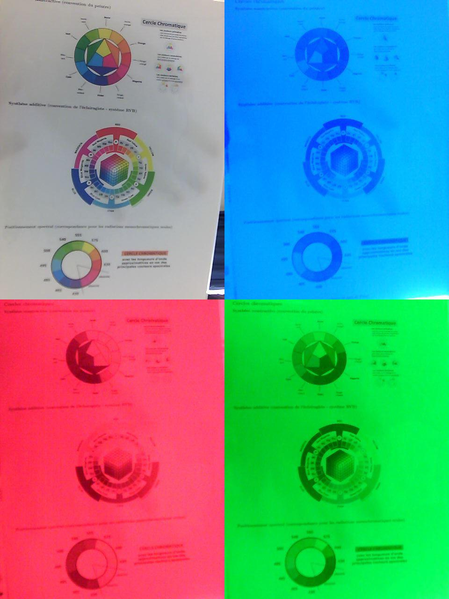
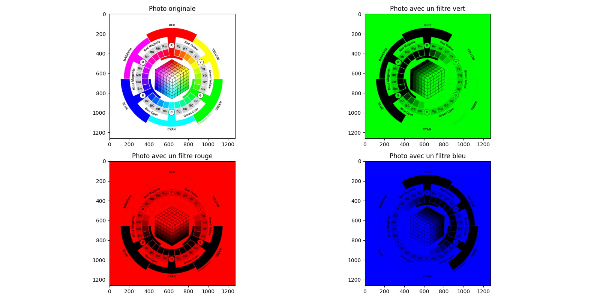

# Compte rendu du TP de physique chimie n°3

Quelle relation exitste-t-il entre la couleur de la solution et la presence d'éspèces chimiques colorantes dissoutes ?

## Objectif

- Explorer les propriété des filtres
- Explorer les propriété des solutions colorées
- Début d'une réfléxion sur le moyen d'analyser une solution avec la spectrophotométrie et la mesure de l'absorbance

## Moyens

- 1 jeu de filtres primaire (RVB)

- 1 jeu de filtres secondaires (CMJ)

- 1 source LED de lumière blanche

- 1 spectrophotomètre USB avec fibre optique + cuve + syseme porte cuve

- 5 cuves de spectrophotométrie + porte cuve

- 1 fiole jaugée de 50mL avec bouchon

- 2 bechers de 50mL

- 3 erlenmeyers de 50mL

- du papier d'essuyage

- 1 verre à pied

- 10 pipette compte-goutte

- 1 pisette d'eau déminéralisé

- 1 flacon de 60mL avec bleu patenté (E133) à la concentration de $1.0*10^-5$ mol/L

- 1 flacon de 60mL avec jaune de tartrazine (E102) à la concentration de $1.0*10^-4$ mol/L

- 1 ordinateur (avec un logiciel de spectromètre et un logiciel d'observation)

- 1 webcam

## Méthodes

Pour ce tp on realise trois montages :

- schema du pemier montage avec la lumiere, les filtres, la fibre et le spectrophotomètre 
  
  

- schema d'une camera qui observe des schema à travers un filtre.
  
  

- schema de flacon avec des colorants de differentes concentrations.
  
  

On obtient les données avec le spectrophotomètre relié a l'ordinateur et la caméra. On obtient une photo et un schéma de l'intensité lumineuse en fontion de la longueur d'onde.

Dans ce TP on considère la lumière comme étant une onde.    

###### Protocole pour obtenir de la lumière filtré :

- Aligner la lampe, le systeme porte filtre et la fibre optique.

- Mettre l'autre côté de la fibre optique dans le spectrophotomètre.

- étalonner le logiciel du spectrophtomètre avec une lumiere blanche 

- Realiser un spectre avec differents filtres coloré : 
  
  - les trois primaires
  
  - les trois secondaires
  
  - rouge + tous les autres 
  
  - magenta et cyan ensemble
  
  - magenta et jaune ensemble

###### Protocole pour obtenir une image avec un filtre:

- Relier la caméra à l'ordinateur

- Aligner la camera un filtre et une image

###### Protocole pour obtenir des solutions colorées de concentration 5 fois inferieures à la solution mère

- mettre environ 20 mL de solution mère dans un becher 

- en prélever 10 mL dans une pipette gradué

- La vider dans une fiole jaugé de 50 mL 

- Compléter la fiole jusqu'au trait de jauge.

- Remplir une cuve de spectrophotométrie avec la solution fille 

###### Protocole pour obtenir une solution fille a partir de deux solutions mères et d'un solvant

- Mettre environ 20 mL de chacune des solutions mères dans un becher distinct

- Prelever 10 mL de la première solution mère dans une pipette jaugée

- La verser dans la fiole jaugée

- Prelever 10 mL de la seconde solution mère dans une pipette jaugée

- La verser dans la fiole jaugée

- Compléter la fiole jusqu'au trait de jauge 

- mélanger 

- Remplir une cuve de spectrophotométrie avec la solution fille

###### Protocole pour obtenir une photo filtrée numériquement

- soumettre la photo à ce code 

```python
# importation des bibliothèques et modules

import matplotlib.image as mpimg                # ou "import imageio as mpimg"
import matplotlib.pyplot as plt
import numpy as np
import sys
##

# Définition de la fonction filtre_vert

def filtre_vert( image ):
    photo = np.copy(image)                      # copie de l'image à filtrer
    for i in range(photo.shape[0]):             # i indique la ligne sur laquelle se trouve le pixel
        for j in range(photo.shape[1]):         # j indique la colonne sur laquelle se trouve le pixel
            r, v, b = photo[i, j]               # valeurs des composantes rouge, verte et bleue du pixel situé sur la ligne i et la colonne j
            photo[i, j] = (0,v,0)              # conserve la valeur de la composante verte et annule les composantes rouge et bleue
    return photo
##

# Définition de la fonction filtre_rouge

def filtre_rouge( image ):
    photo = np.copy(image)                      # copie de l'image à filtrer
    for i in range(photo.shape[0]):              # i indique la ligne sur laquelle se trouve le pixel
        for j in range(photo.shape[1]):          # j indique la colonne sur laquelle se trouve le pixel
            r, v, b = photo[i, j]               # valeurs des composantes rouge, verte et bleue du pixel situé sur la ligne i et la colonne j
            photo[i, j] = (r,0,0)              # conserve la valeur de la composante rouge et annule les composantes verte et bleue
    return photo
##

# Définition de la fonction filtre_bleu

def filtre_bleu( image ):
    photo = np.copy(image)                      # copie de l'image à filtrer
    for i in range(photo.shape[0]):             # i indique la ligne sur laquelle se trouve le pixel
        for j in range(photo.shape[1]):         # j indique la colonne sur laquelle se trouve le pixel
            r, v, b = photo[i, j]               # valeurs des composantes rouges, vertes et bleues du pixel situé sur la ligne i et la colonne j
            photo[i, j] = (0,0,b)              # conserve la valeur de la composante bleue et annule les composantes rouge et verte
    return photo
##

# programme principal

# Lecture de l'image sous forme d'un tableau de nombres

photoOriginale = mpimg.imread("cercle_chroma_addit.jpg")   # image placée dans le même dossier que le fichier python ou copier le chemin d'accès
#création d'une figure
fig=plt.figure(num="filtrage d'une image", figsize=(16,8))

# Application de la fonction filtre_rouge à la photo choisie

photoFiltreR = filtre_rouge(photoOriginale)

# Application de la fonction filtre_vert à la photo choisie

photoFiltreV = filtre_vert(photoOriginale)

# Application de la fonction filtre_rouge à la photo choisie

photoFiltreB = filtre_bleu(photoOriginale)

# position de l'image originale avec un titre

fig.add_subplot(2, 2, 1) # sous-figures en 2x2 on crée une première sous-figure en (1,1)
plt.imshow(photoOriginale)
plt.title('Photo originale')

# création des photos filtrées avec titre

fig.add_subplot(2, 2, 2) # sous-figures en 2x2 on crée une deuxième sous-figure en (1,2)
plt.imshow(photoFiltreV)
plt.title('Photo avec un filtre vert')
fig.add_subplot(2, 2, 3) # sous-figures en 2x2 on crée une troisième sous-figure en (2,1)
plt.imshow(photoFiltreR)
plt.title('Photo avec un filtre rouge')
fig.add_subplot(2, 2, 4) # sous-figures en 2x2 on crée une quatrième sous-figure en (2,2)
plt.imshow(photoFiltreB)
plt.title('Photo avec un filtre bleu')

# Affichage de la figure

fig.tight_layout() # ajuste les sous-figures les unes par rapport aux autres
plt.savefig("photo_filtree.png")
plt.show()
if sys.platform.startswith('darwin'):
    sys.exit()
```

## Observations

###### Filtrage de la lumière par des filtres colorés :


| couleur du filtre | longueur d'onde | Intensité |
| ----------------- | --------------- | --------- |
| Rien              | 450.7           | 19.780    |
| Cyan              | 450,7           | 12.308    |
| Bleu              | 450.7           | 8.823     |
| 2 cyan            | 450.7           | 8.182     |
| Bleu + cyan       | 450.7           | 7.106     |
| Rien              | 517             | 17.192    |
| Cyan              | 517             | 12.503    |
| 2 cyan            | 517             | 9.560     |
| Rien              | 650             | 8.181     |
| Rouge             | 650             | 5.812     |
| 2 rouge           | 650             | 4.927     |

###### Filtrage d'une image avec un filtre



###### Filtrage d'une image avec un algorithme



###### Filtrage de la lumière par une solution


| couleur de la solution | concentration              | longueur d'onde | Absorbance |
| ---------------------- | -------------------------- | --------------- | ---------- |
| eau                    |                            | 420             | 0.000      |
| bleu                   | <p>1.1*10<sup>-4</sup></p> | 420             | 0.000      |
| jaune                  | <p>1.1*10<sup>-4</sup></p> | 420             | 0.988      |
| jaune                  | <p>2.2*10<sup>-5</sup></p> | 420             | 0.518      |
| bleu et jaune          | <p>2.2*10<sup>-5</sup></p> | 420             | 0.358      |
|                        |                            |                 |            |
| eau                    |                            | 629.5           | 0.000      |
| bleu                   | <p>1.1*10<sup>-4</sup></p> | 629.5           | 0.402      |
| bleu                   | <p>2.2*10<sup>-5</sup></p> | 629.5           | 0.049      |
| jaune                  | <p>1.1*10<sup>-4</sup></p> | 629.5           | 0.000      |
| bleu et jaune          | <p>2.2*10<sup>-5</sup></p> | 629.5           | 0.071      |

## Exploitation

###### Filtrage de la lumière avec un filtre

On calcule la transmittace et l'absorbance de chaque filtre pour une longeur d'onde :

$$
T = \frac{I}{I_0} \hspace{1cm}A = -\log_{10} T
$$

Avec T = la transmittance (sans unité)

          I = L'intensité du a limère transmise

         I<sub>0</sub> = l'intensité incidente (celle de la lumiere blanche pour la longuer d'onde)

           A = l'absorbance (sans unité)

On obtient :

| couleur du filtre | longueur d'onde | Intensité | Transmittance (%) | Absorbance |
| ----------------- | --------------- | --------- | ----------------- | ---------- |
| Rien              | 450.7           | 19.780    | 100.0             | 0.000      |
| Cyan              | 450.7           | 12.308    | 62.23             | 0.206      |
| Bleu              | 450.7           | 8.823     | 44.62             | 0.353      |
| 2 cyan            | 450.7           | 8.182     | 41.37             | 0.384      |
| Bleu + cyan       | 450.7           | 7.106     | 35.93             | 0.444      |
| Rien              | 517             | 17.192    | 100.0             | 0.000      |
| Cyan              | 517             | 12.503    | 72.72             | 0.136      |
| 2 cyan            | 517             | 9.560     | 55.63             | 0.265      |
| Rien              | 650             | 8.181     | 100.0             | 0.000      |
| Rouge             | 650             | 5.812     | 71.05             | 0.154      |
| 2 rouge           | 650             | 4.927     | 60.22             | 0.219      |

On voit que lorsqu'il y a plusieurs filtre, la transmittance globale est egale au produit des transmittance de chaque filtre :

$$
T_{cyan+cyan} = T_{cyan} \times T_{cyan} = {T_{cyan}}^2
$$

Par exemple, pour les deux filtres cyan on a :

$$
T_{cyan+cyan} = 41.37\%
$$

$$
{T_{cyan}}^2 = 62.23\%^2 = 38.73\%           
$$

Par contre,l'absorbance d'un ensemble de filtre est egale a l'absorbance de chaque filtre.

$$
A_{cyan + cyan} = A_{cyan}+A_{cyan}=2\times A_{cyan}
$$

Par exemple pour le cyan : 

$$
A_{cyan+cyan}= 0.265 \hspace{1 cm} 2\times A_{cyan}=0.136\times2=0.272
$$

la somme est une opération plus simple que le produit donc il est logique de travailler avec l'absorbance. Plus l'epaisseur du filtre est grande et plus l'absorbance est grande. Pour la transmittance, c'est l'inverse.

###### Filtrage d'une image avec un filtre

On voit que sur l'image numérique, le filtre est asolu est obitent du noir pour toute les couleurs qui ne contiennent pas la couleur du filtre. Alors que sur l'image filtrée expérimentalement,le filtre laisse passer un peu du rest. Par exemple, sur l'image bleue, on voit que c'est majoritairement gris alors que le decoupage devrait être plus franc. On voit aussi que le filtre vert est le meilleur des trois.

Lorqu'on place un filtre rouge sur le trajet d'un faisceau de lumière blanche, on obtient de la lumière rouge. Or la lumière blanche est composé de lumière rouge, verte et bleue. Donc la lumière bleue et verte ont été absorbée. Le filtrage relève onc de la synthèse soustractive. 

Lorsqu'on parle de la couleur d'un filtre, on parle de la couleur que le filtre laisse passer.

###### Filtrage de la lumière avec une solution

Les cuves de spectrophotométrie font toutes la même largeur. Grace a cela on peut comparer les resultats car la lumiere traverse autant de solutions dans chaque cas.

La couleur de la solution est la couleur que la solution laissé passé comme dans le cas d'un filtre. Donc lorsqu'on observe la couleur d'une solution rouge à travers un filtre vert cela fait comme si on observe de la lumiere blanche a travers deux filtre rouge et vert. Dans ce cas on voit la soution noire.

Lorsqu'on dilue la solution 5 fois, l'absorbance diminue. En effet la lumière est moins absorbée parce qu'il y a moins de soluté absorbant. Dans le cas de la solution jaune, lorsque la concentration passe de 1.1\*10<sup>-4</sup> mol/L à 2.2*10<sup>-5</sup>, l'absorbance passe de 0,988 à 0,518.

Lorsqu'on melange les deux solutions il y a une synthese additive. La solution est donc verte et laisse passer le vert. 

Chaque colorant subit une dilution de facteur 5 et elle est donc concentré pour chaque colorant à 2.2\*10<sup>-5</sup> mol/L.

Lorsqu'on compare differentes solutions, il faut prendre dux longueurs d'onde caractéristiques.
